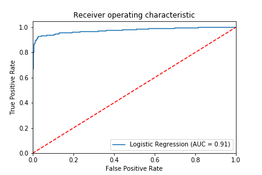
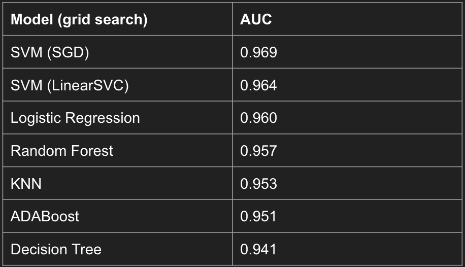

## Classification of Pulsars

This project utilizes the [Predicting a Pulsar Star](https://www.kaggle.com/pavanraj159/predicting-a-pulsar-star/) dataset from Kaggle. The purpose is to determine the most accurate model in predicting whether or not a star is a pulsar.

### Dependencies

This project uses:
- Pandas 0.25.1
- Numpy 1.18.0
- Matplotlib 3.1.1
- Seaborn 0.9.0
- Scikit-learn 0.22.0

### Data

Features:
1. Mean of the integrated profile
2. Excess kurtosis of the integrated profile
3. Standard deviation of the integrated profile
4. Skewness of the integrated profile
5. Mean of the DM-SNR curve
6. Excess kurtosis of the DM-SNR curve
7. Standard deviation of the DM-SNR curve
8. Skewness of the DM-SNR curve

There are 17,900 datapoints.

### Exploration

- Data cleaned, normalized
- Skewed target variable
	- Tried oversampling, undersampling, SMOTE
- Created base model (logistic regression)

### Models

The models I used were:
- Logistic Regression
- K-Nearest Neighbors
- Decision Tree
- SVM
- SVM with Stochastic Gradient Descent
- Random Forest
- Adaboost

I applied gradient descent to all models in order to boost ROC.

### Results

My most accurate model was SVM (SGD). This surprised me, as I had expected an ensemble method like Random Forest or AdaBoost to have the highest accuracy.

